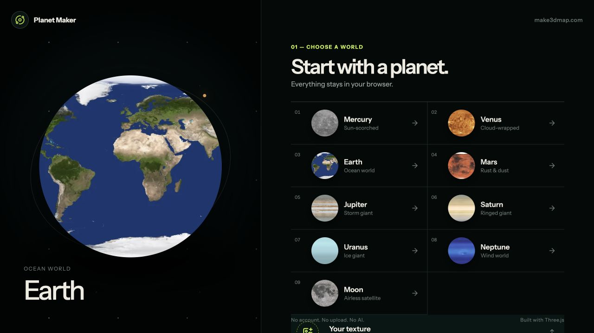

# Planet Maker

An offline-first 3D planet editor for the browser. Pick a world, reshape its surface, place local 3D objects, add markers and text, tune the sun, then export the result — without an account, API key, database, or AI service.

[](https://github.com/DophinL/planet-maker/actions/workflows/ci.yml)
[](LICENSE)
[](https://threejs.org/)

> Want the hosted product and more planet-making tools? Visit [make3dmap.com/3d-planet-maker](https://make3dmap.com/3d-planet-maker).



## What you can make

- Start from Mercury, Venus, Earth, Mars, Jupiter, Saturn, Uranus, Neptune, or the Moon.
- Upload any PNG, JPEG, or WebP as a custom equirectangular surface map. It is cropped to 2:1 locally.
- Adjust surface rotation, relief, roughness, atmosphere, clouds, and auto-rotation.
- Place 20 bundled CC0 GLB objects, or load your own GLB for the current browser session.
- Add geographic markers and billboard text directly on the sphere.
- Control sun direction, intensity, ambient light, and the scene backdrop.
- Export a PNG snapshot, portable GLB scene, or editable `.planet.json` project.
- Install it as a PWA, then optionally download the complete planet and model library for offline work.

All editing data stays in the browser. The application contains no API routes, analytics, authentication, database client, or server-side rendering.

## Quick start

Requirements: Node.js 22 or newer and npm.

```bash
git clone https://github.com/DophinL/planet-maker.git
cd planet-maker
npm install
npm run dev
```

Open [http://localhost:5173](http://localhost:5173). There are no environment variables to configure.

Production checks:

```bash
npm run typecheck
npm test
npm run build
npm run preview
```

## Controls

| Action | Mouse / keyboard |
| --- | --- |
| Orbit | Drag the planet |
| Zoom | Mouse wheel or trackpad scroll |
| Place an item | Choose an object, marker, or text layer, then click the sphere |
| Cancel placement | `Esc` |
| Delete selection | `Delete` or `Backspace` |
| Pause rotation | `Space` |

## Architecture

```text
src/
├── components/
│   ├── picker/          # world-first entry experience
│   ├── editor/panels/   # surface, objects, markers, sun, text, export
│   └── scene/           # Three.js scene and placed layers
├── data/                # typed planet and object catalogs
├── lib/                 # spherical math, image processing, downloads, GLB export
├── store/               # persisted browser-local editor state
├── types/               # serializable project contracts
└── styles/              # responsive product UI
```

The picker is a separate lazy-loaded boundary from the 3D editor, so Three.js is only downloaded after a world is selected. Static textures, previews, and models live under `public/assets/`; the PWA precaches the application shell and common starter assets, then caches other assets as they are used. The Export panel can download the complete library on demand. See [docs/ARCHITECTURE.md](docs/ARCHITECTURE.md) for the runtime and data boundaries.

## Privacy and offline behavior

- Custom textures are processed with a local canvas and stored as browser data when small enough.
- Uploaded GLBs use an in-memory object URL and are intentionally not embedded in project JSON.
- Projects persist in `localStorage`; clearing site data clears the saved project.
- The Tripo and Make3DMap cards are ordinary outbound links. Nothing is sent until you choose to follow one.
- The installed PWA keeps the app shell and common starter assets ready. Use **Export → Download offline library** once to cache all nine planets and 20 built-in objects. A source checkout can always be run without internet after dependencies are installed.

## Built-in assets and attribution

The repository contains nine planetary texture sets and exactly 20 lightweight 3D objects. Their licenses and original source links are recorded in [THIRD_PARTY_NOTICES.md](THIRD_PARTY_NOTICES.md) and [`public/licenses`](public/licenses). Please preserve those notices when redistributing the bundled assets.

## Acknowledgements

Planet Maker would not exist without [Three.js](https://threejs.org/), the open-source 3D engine that makes expressive WebGL work approachable on the web. The renderer is composed with [React Three Fiber](https://r3f.docs.pmnd.rs/) and helpers from [Drei](https://drei.docs.pmnd.rs/).

Thanks also to the Three.js community, Solar System Scope, Kenney, Quaternius, Poly Pizza, and every creator whose openly licensed work makes small, playful 3D projects possible.

If you build something interesting, please share it with the [Three.js community forum](https://discourse.threejs.org/) and link back here so others can learn from it.

## Contributing

Issues and focused pull requests are welcome. Read [CONTRIBUTING.md](CONTRIBUTING.md), follow the [Code of Conduct](CODE_OF_CONDUCT.md), and keep new runtime features browser-local unless a proposal explicitly establishes a different project boundary.

## License

Source code is released under the [MIT License](LICENSE). Bundled third-party textures and models retain their original licenses; see [THIRD_PARTY_NOTICES.md](THIRD_PARTY_NOTICES.md).
